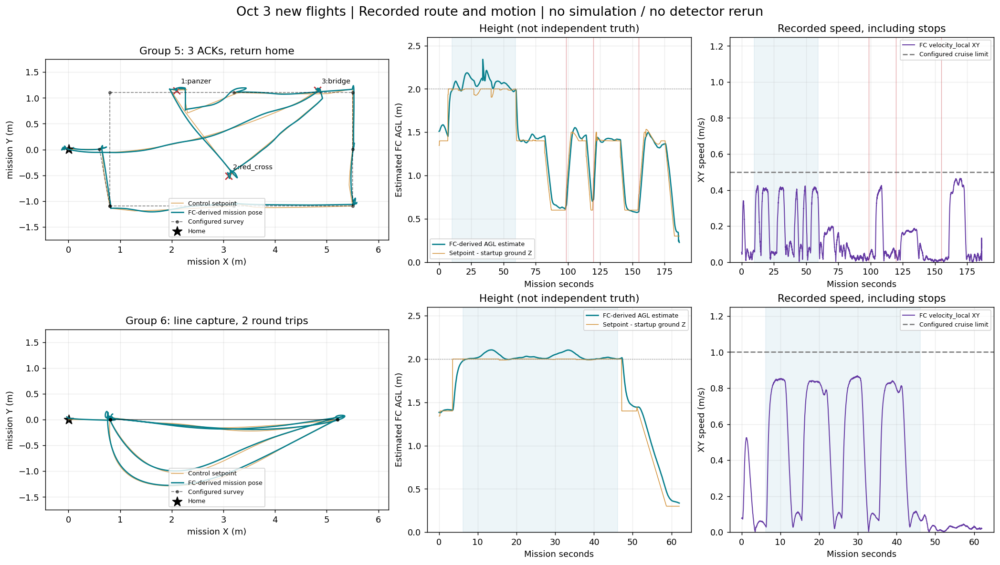
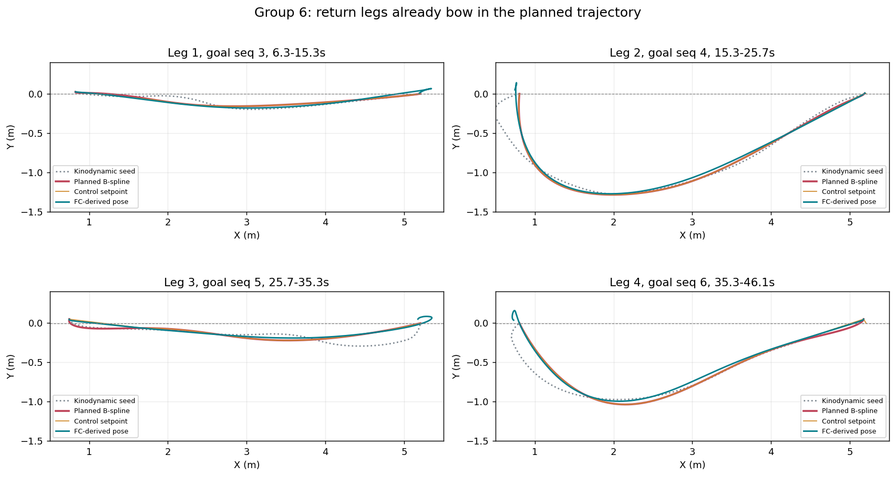
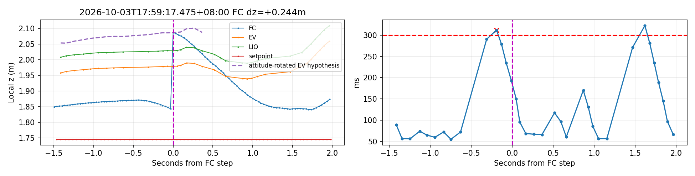

# 10月3日晚第五、六组复盘与配置更新

本次读取新三轮173929、175604、181136的bag、任务文本和实际参数，复用候选阈值工具离线A/B；独立交叉核对另一会话f9ac95c的17:14 ULog结论。未连接飞机、未运行新仿真或实飞，未改飞控融合参数、安装外参或现场位姿保护。新配置等待部署/飞行验证。

## 结果与实际流程

| 目录logs/site_download_20261003_后缀 | 专项 | 原始结果 | 本次复核 |
|---|---|---|---|
| 173929 | 第五组 | INCOMPLETE，0/3 | 54.79s高位中断进入重访；规划有重试失败，70.91s切MANUAL，未投递 |
| 175604 | 第五组 | INCOMPLETE，3/3 | 三槽成功回执、返起点、30cm悬停流程、人工落地、任务COMPLETE；新离线汇总PASS |
| 181136 | 第六组 | CAPTURED，0/0 | 两次往返四段均到点；采集链完成，不能据此宣布1m/s识别验收 |

时间以任务首次命令为零，不含初始化/起飞。175604依次panzer槽1（98.72s）、red_cross槽2（119.82s）、bridge槽3（154.95s），均success=true/raw_actuator_ack；160.41s返航、174.48s到起点、175.58s下降悬停、186.01s POSCTL、187.01s未解锁、188.40s COMPLETE。回执不等于独立测量包裹落点。

旧汇总普通投递专项强制要求AUTO.LAND的mode_sent；现场采用terminal_hover，所以误判INCOMPLETE。本次只修离线trial_result：设置悬停终点时，还需同任务LAND记录、三投数相符、mission_failed=false、COMPLETE、PILOT_HANDOFF、曾起飞且现已未解锁/落地，才认定人工末段完成。H/走廊/整场原验收不放宽。原始result.json未改，独立复算见[result_reclassification.json](group5_group6_20261003_assets/result_reclassification.json)。

## 圆环0.75的作用范围及复跑

新增target_memory/drop_circle_geometry_confidence=0.75，仅投递drop_circle模式的辅助圆环重新确认准入使用。搜索圆环、H保持aux_geometry_confidence=0.80；类别YOLO门槛、红十字、几何有效/地图有效、连续三帧、关联上下文、稳定对齐、陈旧拒绝、投递许可和槽位事务均不放宽。

成功轮panzer投递窗口原始圆环355条，评分中位0.8175，350条≥0.80；bridge230条，中位0.8387，219条≥0.80。与17:14旧轮中位0.786、几乎不过0.80的情形不同。

| bag | 0.80新鲜圆环确认帧 | 0.75新鲜圆环确认帧 | 首次确认 |
|---|---:|---:|---|
| 171424旧失败轮 | 0 | 490 | 0.75在drop_circle切换后约0.55s产生 |
| 173929 | 0 | 0 | 没有进入drop_circle窗口，不能记成圆环失败 |
| 175604成功轮 | 193 | 199 | 两次首次确认时刻均未改变 |

这里重放的是记录mapped输入和模式切换、运行生产TargetMemory，不重跑YOLO或飞行响应。原始圆环与mapped融合帧的计数不同，不能把mapped样本数当独立相机检测次数。新放行低分样本的邻时中心差是投影一致性，不是靶心真值；成功轮新增样本中可配对14条、差值P95约21.8cm（含运动/时序影响），所以仍需后续对齐与稳定许可，不能凭0.75直接投。具体结果见[阈值复跑JSON](group5_group6_20261003_assets/threshold_result.json)。

## 第六组航线复核

旧第六组虽在settings中带第五组survey_xy，生成器仍用capture_line_xy覆盖，实际为X=0.8↔5.2、Y=0的两次往返。四段均到点成功，无任务ABORT/规划失败，但两条返程并不直：

| 航段 | 实际最大偏离中线 | B-spline最大偏离 |
|---|---:|---:|
| 去程1 | 0.181m | 0.159m |
| 返程1 | 1.272m | 1.285m |
| 去程2 | 0.189m | 0.220m |
| 返程2 | 0.993m | 1.035m |

偏移已在kinodynamic搜索初始曲线和后续B-spline出现，设定点/机体跟随；不是飞机自行偏离一条直线。局部录包点云不足以重建当时全SDF或确定为何选弯路，不能认定是绕真实障碍或地图虚障。记录中心点在center_bounds内，不等于机体净空已验证。后续需抓生成时的完整局部占据与动力学初态；本次不猜因修改搜索器。

旧第六组设1.0m/s，高位运动样本（XY速度>0.15）中位0.804、P95 0.858、最大0.869m/s；不能称已实测1m/s。第五组对应0.387/0.414/0.425m/s。第六组记住三类，panzer主要通过bbox粗线索形成位置记忆，不能等同低位confirmed或投递通过。

新版第六组与第五组现场入口共读test_area.yaml中的入场/巡航点，保留完整巡圈、不提前中断的拍摄语义；正常尾段改为返起飞点再30cm悬停（旧版在X≈0.8升降柱结束）。仅本专项采用现有正赛档：max_vel1.2m/s、max_acc1.0m/s²、巡航前视1.0m、精调0.4m/终止0.15m；仍2m高位/上限、1.4m低位。原八组速度未改，到点刹停/驻留未取消，短段可能达不到上限。

操作和完整点表见[新版第09模块手册](../../../deployment/board_trials_4x4/09_high_speed_capture/README.md)。工作台第6卡片新增1.2档并作为默认。0.5/1.0档仅作为同路线对照，新默认未实飞。

## 新高度跳变与另一会话的交叉结论

旧17:14轮：独立解析px4_log781.ulg，六次EV停融后的Z reset、无EKF实例切换，与f9ac95c的[ULog专题](PX4_JUMP_ULOG_171424_20261003.md)一致。高度/位置先恢复、航向稍后恢复时，固件把EV位置按姿态差旋转，再以EV高度重置；这解释旧轮37.6/52.4cm事件。已对照该固件revision的[PX4高度融合源码](https://raw.githubusercontent.com/PX4/PX4-Autopilot/30e763b6780061d70a14894e3e8b06e6a656f9b8/src/modules/ekf2/EKF/ev_height_control.cpp)。

新175604成功轮仍在**17:59:17.475出现+24.37cm高度阶跃**：32.2ms内FC Z由1.8435到2.0872m，设定Z不变、LIO连续；前有过期LIO未转发和EV接收间隔，之后目标垂速−0.095→−0.331m/s，LIO约下降5cm。姿态差旋转后EV Z=2.08676m，与阶跃后FC2.08720m吻合，强烈支持同类恢复重置机制；这不是亚毫米定位精度，也不是精确回放PX4内部滤波。

**新三轮尚无对应ULog。** 因此不能确认新轮融合事件、精确reset次数或EKF实例切换。173929最大相邻FC Z差4.10cm；第六组181136最大2.39cm，没有旧轮那类突跳，表现为连续起伏。第五组24.4cm事件也未超过原3×dt+0.25保护门槛；“未ABORT/任务成功”不能证明定位重置消失。

## 是否把飞控和雷达装平即可

需要核对安装和飞控水平标定，但**单靠机械摆平不能认定根治**。要分开处理两件事：

1. 坐标一致性：雷达IMU到机体的固定旋转，和LIO启动世界系到重力世界系的旋转。当前桥只补平移、TF单位旋转；FAST-LIO初始化gravity并不自动保证其世界Z按重力校正。实际姿态关系须量测后统一到EV位置/姿态、地图、TF、相机投影与任务设定点；不能只改一个TF或套用雷达内部IMU外参。
2. 输入连续性：查LIO排队/处理/发布、MAVROS发送及FC实际EV输入时效，解决触发停融的迟到/间断。禁止重发旧姿态或重盖now掩盖缺帧。机械调整不会消除超时触发。

三次新飞行相对pitch中位数为−4.41°、−1.27°、−1.02°，所以不能把旧4.4°直接写成固定补偿。若现场实测安装歪斜，可机械校正并重新核对外参/水平标定；若启动坐标系未重力对齐，则仍需坐标初始化修正。不能凭这几次bag区分全部来源。新ULog补齐后再对照17:59:17.475附近EV状态/高度reset；本轮没有改现场保护或固件。

详细数据：[新三轮高度摘要](group5_group6_20261003_assets/new_flights_altitude_summary.json)、[旧ULog独立复算](group5_group6_20261003_assets/old_ulog_independent_crosscheck.json)。原始与分析脚本位于logs/new_site_routes_20261003、logs/altitude_crosscheck_20261003、logs/ring_capture_update_20261003；bag不入Git。

## 验证与交付边界

实现提交：圆环1786c7b，高速路线/结果汇总5211a1c；另一会话ULog分析f9ac95c已作为本分支祖先保留。

- 视觉11项、板端专项/结果21项、工作台18项离线测试通过；18种application参数展开通过，0.5/1.0/1.2现场CLI配置校验通过。未启动ROS master、飞行或SITL。
- 圆环参数与核心实现同步视觉研究/整机候选；导航liveness仅按其部分视觉镜像做对应小补丁，完整试飞工程仍以视觉板端分支/导航板端参考分支为准。
- 完整报告及另一会话f9ac95c保留在板端部署分支；未合main、未覆盖试飞组“板载代码”、未部署飞机。本次是已录飞行的复盘和下一轮配置准备，不能写成新版高速或0.75已实飞验收。
