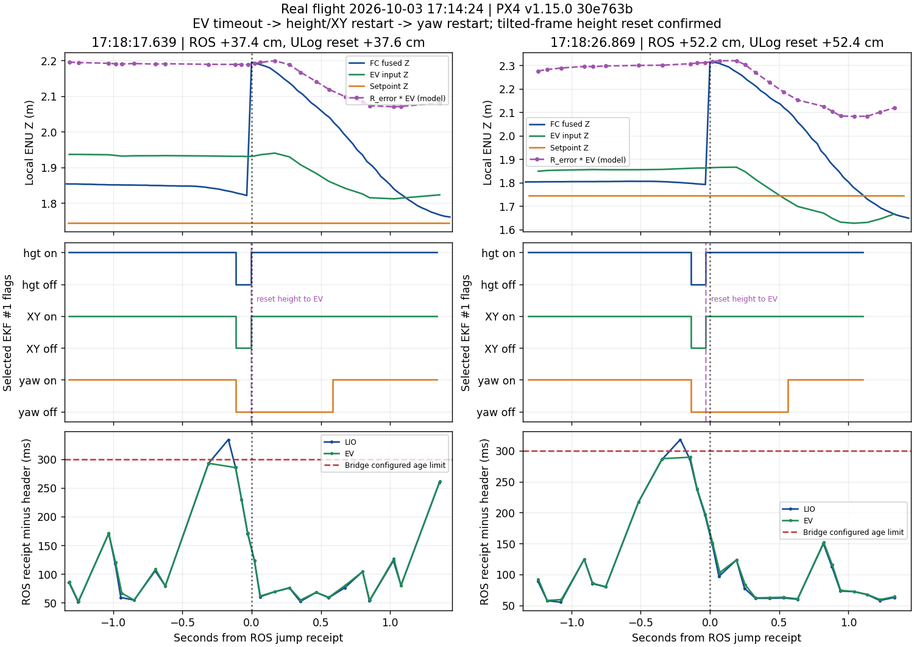

# 10月3日 17:14:24 实飞：ULog 确认的高度跳变机制

## 结论与适用范围

**这轮两次明显跳变是 PX4 在外部定位超时后恢复 EV 高度融合时的垂直位置重置。** 高度与水平位置先恢复，航向稍后恢复；这个间隙中，固件对 EV 位置施加三维姿态差旋转，再以旋转后的高度重置状态。ROS 姿态对中约 4.4° 的俯仰差会把水平位置投到高度上，计算结果与跳变后的飞控高度相差 0.7 / 0.2 cm。

因此，“跳变首先出现在飞控融合输出”成立，但**不能解释成“与 LIO 无关的飞控随机跳变”**：LIO/EV 的时效问题触发了停融，姿态/坐标接口的不一致放大了恢复时的高度差。当前已确认停融、恢复、重置和固件分支；4.4° 差值具体来自启动世界坐标、IMU—机体安装外参还是标定，还未独立测量。

本报告仅覆盖新取回的 `board_high_priority_20261003_171424`。午间 115933 / 122529 / 124630 三轮的 ULog 尚未匹配，不能把这份 ULog 当作它们的直接证明。此前证据见 [午间诊断](LIO_POSE_DIAGNOSIS_20261003.md)，操作步骤见 [排查流程](LIO_PX4_DIAGNOSTIC_WORKFLOW_20261003.md)。

本轮只读取日志、运行离线分析并修订诊断工具/文档；未修改或部署飞行链、飞控参数，没有启动 ROS、SITL 或实机动作。

## 日志匹配与当轮配置

| 项目 | 核对结果 |
|---|---|
| ROS bag | `logs/board_high_priority_20261003_171424/flight_debug_0.bag`，268,730,492 字节；约 17:14:25–17:21:01 |
| 实飞 ULog | `logs/board_high_priority_20261003_171424/ulog/px4_log781.ulg`，8,460,479 字节；boot 1076.608–1283.755 s |
| 原飞控文件名 | `/fs/microsd/log/2026-09-22/21_27_57.ulg`；文件日期未对准现场日期，按共同数据匹配 |
| 固件 | PX4 v1.15.0，`ver_sw=30e763b6780061d70a14894e3e8b06e6a656f9b8`，release `0x010f00ff`，FMUv6C |
| 时基匹配 | 将 ULog NED 转为 ROS ENU 后，606 对 XYZ 完全匹配至 6 位小数；`ROS header epoch = PX4 boot sec + 1791017970.233053` |
| 对齐残差 | 最小 / P5 / P50 / P95 / 最大：−5.13 / −4.35 / 0 / +2.83 / +3.40 ms |
| 主 EKF | 全程 instance 1；`instance_changed_count` 恒为 2，表示进入日志前的历史计数，飞行中没有实例切换 |
| logger dropout | 0；不等于传感器/MAVLink 链路无丢包 |
| 实际参数 | `EV_CTRL=15`、`HGT_REF=3`、`EV_DELAY=0`、`EV_NOISE_MD=0`、`EVP_NOISE=0.1`、`EVV_NOISE=0.1`、`EVA_NOISE=0.1`、`DELAY_MAX=200 ms` |
| 其他高度源 | `BARO_CTRL=1`；事件中 `cs_baro_hgt=1`，`cs_rng_hgt=cs_gps_hgt=0` |
| 日志缺口 | `SDLOG_PROFILE=1`；未记录原始 `vehicle_visual_odometry` 和 `estimator_aid_src_ev_hgt`，有解码后的融合状态、事件及约 2 Hz 创新记录 |

参数名除 SDLOG 项外均有 `EKF2_` 前缀。本轮相关参数未见飞行内改动。`EV_CTRL` 的速度位虽然开启，`cs_ev_vel` 却全程为 0；当前 `PoseStamped` 接口没有外部速度，不能按配置位声称速度已融合。

ULog 的 `vehicle_local_position` 只记录约 10 Hz，ROS 飞控位置约 30 Hz。下表使用频率更高的 `estimator_event_flags` 标记恢复时刻；计数变化首次被记录可能晚约 30–60 ms，不能把日志采样差当成另一次重置。

## 不止两次：六次停融后高度重置

| EV 高度恢复/重置时刻（对齐北京时间） | Z counter | ULog ΔZ，转换为 ENU 向上 | 航向晚于高度恢复 |
|---|---|---:|---:|
| 17:17:36.237 | 3→4 | +7.11 cm | 513 ms |
| 17:17:48.632 | 4→5 | +13.04 cm | 592 ms |
| **17:18:17.633** | **5→6** | **+37.64 cm** | **592 ms** |
| **17:18:26.840** | **6→7** | **+52.42 cm** | **592 ms** |
| 17:20:04.450 | 7→8 | +27.70 cm | 375 ms |
| 17:20:47.565 | 8→9 | +2.94 cm | 552 ms |

六次都记录到 `vision_data_stopped`，随后 `cs_ev_hgt/cs_ev_pos/cs_ev_yaw` 从 1/1/1 变成 0/0/0，再变成 1/1/0，同时出现 `reset_hgt_to_ev`；最后航向恢复为 1。还发生 12 次水平位置重置；没有垂速或航向 reset counter 变化。较小的重置未必超过任务层 `3*dt+0.25 m` 门槛，不能只统计任务 ABORT 来判断估计稳定性。

两次主要事件的原始时间顺序：

| 事件 | `vision_data_stopped` | 高度恢复且 `reset_hgt_to_ev` | 航向恢复 | ROS 首次收到大差分 |
|---|---:|---:|---:|---:|
| 第一次，boot s | 1127.291985 | 1127.400778 | 1127.992660 | 北京时间 17:18:17.639 |
| 第二次，boot s | 1136.498130 | 1136.606961 | 1137.198729 | 北京时间 17:18:26.869 |

ROS 两帧 Z 差分分别为 +37.37 / +52.21 cm，与 ULog 精确 reset delta 的 +37.64 / +52.42 cm 对应。差别来自正常运动、发布和记录采样；这是位置重置，不是飞机在 29 / 40 ms 内真实上窜。瞬间反馈垂速分别只有 −0.097 / −0.054 m/s，设定点 Z 均保持 1.7437 m。



图的紫色线是对 EV 做姿态差旋转后的解释模型，不是飞控实际接收到的另一条 EV 数据。横轴按 ROS 收到大差分归零；中排来自主 EKF 1，底排为 ROS 录制时的 age。

## 固件为什么会走到这个分支

本节核对的是 ULog 记录的**同一固件 revision**，不是套用最新 PX4 的行为。

1. [EV 控制代码](https://raw.githubusercontent.com/PX4/PX4-Autopilot/30e763b6780061d70a14894e3e8b06e6a656f9b8/src/modules/ekf2/EKF/ev_control.cpp) 在缺少可供延迟融合时域处理的样本、上一有效样本超时后停止 EV 各项融合，并记录 `vision_data_stopped`。恢复要求连续样本的时间间隔和最新输入满足起始条件。[该 revision 的常量](https://raw.githubusercontent.com/PX4/PX4-Autopilot/30e763b6780061d70a14894e3e8b06e6a656f9b8/src/modules/ekf2/EKF/common.h) 为 `EV_MAX_INTERVAL=200 ms`，停融采用其两倍。
2. [航向融合代码](https://raw.githubusercontent.com/PX4/PX4-Autopilot/30e763b6780061d70a14894e3e8b06e6a656f9b8/src/modules/ekf2/EKF/ev_yaw_control.cpp) 另要求距上次航向融合超过 1 秒。高度和位置不等待这个条件，所以本轮出现约 0.59 秒的高度/位置已恢复、航向尚未恢复的窗口。
3. [高度融合代码](https://raw.githubusercontent.com/PX4/PX4-Autopilot/30e763b6780061d70a14894e3e8b06e6a656f9b8/src/modules/ekf2/EKF/ev_height_control.cpp) 在 EV 航向与位置未同时有效时，用姿态误差四元数旋转整个位置向量；当 `HGT_REF=EV`，重新启动高度融合会直接重置到这个测量高度，而不是只平滑追踪。此次事件状态与这一分支吻合。

**400 ms 是固件延迟融合时域中的样本超时条件，不是“ROS 接收间隔超过 400 ms”这一单一判据。** 因此本轮 312 ms 的接收间隔，加上已陈旧的样本，仍可导致停融。也不能把 `DELAY_MAX=200 ms` 理解为允许任意 age 输入，或直接把 ROS age 填入 `EV_DELAY`。

## 4.4° 倾斜差如何解释高度值

用 EV 消息的 source header 匹配最近的飞控姿态 header，两个主要样本的时差分别为 6.8 / 8.4 ms。以两端现有 ENU/FLU 表达计算：

```text
R_error = R_FC × inverse(R_EV)
p_rotated = R_error × p_EV
```

| 项目 | 第一次跳变 | 第二次跳变 |
|---|---:|---:|
| 最新一条跳变前 EV 的 XYZ，m | (3.2397, −0.7146, 1.9306) | (5.5891, −1.0470, 1.8625) |
| 姿态差 XYZ Euler：roll / pitch / yaw | −1.375° / −4.367° / −0.936° | −1.311° / −4.427° / −1.446° |
| 旋转后的 Z，m | **2.1882** | **2.3117** |
| 飞控跳变后的 Z，m | **2.1951** | **2.3139** |
| 模型与飞控高度之差 | **−0.69 cm** | **−0.22 cm** |
| 旋转贡献的高度变化 | +25.76 cm | +44.92 cm |

旋转贡献不等于全部 jump：跳变前飞控高度与原始 EV 高度已有约 10.9 / 7.1 cm 差异，一起构成恢复时的总高度重置。水平位置从约 3.24 m 增至 5.59 m，同样的倾斜会产生更大的高度投影，解释第二次跳变更大。解锁段 2047 对姿态的俯仰差中位数为 −4.343°，P5–P95 为 −4.443° 到 −4.103°，不是只取一个突变帧得出的角度。

这个计算不是 PX4 内部低通四元数与每条原始 EV 的精确回放；后者未被记录。不过停融/重置已由 ULog 直接确认，旋转模型解释了重置高度，而不只是时序相关。

本轮 bag 的 `/tf_static` 明确记录 `map→camera_init` 为零平移、单位四元数，`vision_body→mapping_imu` 只有 (0,0,0.05) m 平移、零旋转。与飞行中观察到的倾斜差不一致，必须复核机体和世界坐标的合同。此前的相对姿态轴拟合先消除了初始姿态，所以“约 1–2°、没有昨日 90° 串轴”不能证明绝对世界坐标已经重力对齐。

实际部署 FAST-LIO 的 `IMU_Processing.hpp` 初始化重力向量，但没有在该初始化段把旋转对齐到世界 Z；`lio_external_pose.py` 只补安装平移、保持原姿态。这支持优先检查世界重力对齐和机体安装旋转。**不能据此直接断言雷达机械安装歪了 4.4°**：地面/飞行姿态差亦有变化，可能混合启动姿态、不同 IMU 和标定影响。`SENS_BOARD_X_OFF=−2.4845°`、`Y_OFF=−2.3258°` 是实际标定值，不以非零为由清零。

## 输入时效、其他异常与仍缺的观测

| 项目 | 新一轮数据 | 含义 |
|---|---|---|
| LIO→EV | 3918→3860 帧；按 header 配对缺 58 帧，解锁段缺 13 帧 | 配对缺失不等于雷达原始包丢失；边界、ROS 队列与桥接拒收需分开 |
| 解锁段 LIO age | P50 71 ms、P95 154 ms、P99 284 ms、最大 415 ms；14 帧 bag age 超过 300 ms | 平均值改善仍掩盖尾部旧样本 |
| 解锁段 EV 接收间隔 | 最大 635 ms；两次主事件附近出现 312 ms 间隔或约 200 ms 源样本间隔 | 10 Hz 输入缺一帧就可能跨越 200 ms 恢复条件，需要解决真实更新的时效 |
| 两次主事件未转发 LIO | 分别有一条 bag age 334 / 318 ms 的输入 | 事件附近与陈旧输入拒收相符，但没有飞控原始 EV 逐包记录 |
| LIO/EV 几何连续性 | 均未命中同一三维 jump 门槛；定位 header 无回退 | 支持“不是 LIO 位置先瞬间跳”，不证明时效/姿态接口合格 |
| EKF 与 IMU | 无实例切换；两套 IMU accel clipping 记录均为 0；事件中 bad-acc flags 为 0，baro 高度仍在融合 | 当前主因不支持实例切换、IMU 饱和或全部高度源故障；2 Hz 创新不能排除每个未记录的瞬时拒绝 |
| 电池遥测 | `cell_count=6`；电压读数 13.64–31.61 V；connected 切换 10 次，warning 切换 19 次 | 电源测量链另有明显异常，需要实测电压及供电/ADC/功率模块标定；不能按这些读数断言物理电池真的到 31.61 V |

ULog 另有 86 条 battery 日志和 73 条 `Failsafe activated` 文本，但已记录的 `vehicle_status.failsafe` 全部为 0。因此不能说飞机实际进入了 73 次 failsafe 飞行模式，也不能拿电池警告替代已确认的 EV 重置解释。

bag 接收时间与桥接回调处理时间不同；全程一条已转发 EV 的 bag age 达 301.9 ms，解锁段 14 条 LIO 超限与 13 条缺失也不严格相等。不能将午间“缺失全在阈值外”的统计原封不动套到这轮。LIO 的内部队列、ICP/地图移动/发布分阶段计时仍缺失；此前发现的地图盒往返、巨大 FIFO 等性能风险仍需单因素测量，不把其中任意一项宣称为全部延迟根因。

这轮任务最终 `COMPLETE`，但 `result.json=INCOMPLETE`、`mission_failed=true`、提交投递数 0；supervisor 以 `landed_after_flight` 收尾。没有以 ABORT 收尾不代表任务或定位已通过；视觉许可和失败返航另见同期 [第五组复盘](HIGH_PRIORITY_REVIEW_20261003.md)。

## 接下来按什么顺序解决

1. **先区分安装旋转与世界重力对齐。** 停桨、未解锁条件下，核对雷达 IMU—机体三维外参和飞控水平标定；在已知水平姿态启动，读取两侧重力/姿态，随后验证受控姿态和直线平移的轴向。需要改变飞控校准或硬件测试动作时另行确认，不凭本次角度写固定补偿。
2. **把完整坐标合同作为一个独立修复。** 修正方案应同时覆盖 EV 位置/姿态、地图点云、TF、相机投影/地面和任务设定点。世界变换与 IMU—机体外参分开；不能单改 yaw、FAST-LIO 内部雷达—IMU `extrinsic_R`，也不能仅增加 `map→camera_init` TF 却保持发往 PX4 的 EV 未修正。若以地面估计初始化变换，应确认时基/机体一致、固定到整轮，而不是用飞控实时姿态反向持续修补 EV。
3. **同时补时效观测并处理旧数据。** 记录 LIO 回调/队列最旧 age、同步等待、处理与发布耗时、MAVROS 发送和飞控 EV 输入年龄；按地图盒、无用输出、缓冲与并行各自比较。采样时间必须真实，不能重发旧位姿或重盖 now 来凑频率。记录 profile 需补原始 EV/aid-source，具体开销在地面验证。
4. **保留任务保护，先验证再考虑融合参数。** 重置后的下降响应会影响控制，删除连续性门槛或把 ABORT 变成定时自动续飞不能修复它。改变高度参考/融合位/延迟最多作为另一个经验证的试验，不能遮盖坐标问题；本次没有改任何现场参数。

## 离线复查与产物

统计摘要：[px4_jump_171424_metrics.json](px4_jump_171424_metrics.json)。原始 bag/ULog 与详细分析脚本留在忽略的 `logs/` 中，不入 Git。下面只读日志，不连接板端或 ROS master：

```bash
cd /home/xhj/liftrace-worktrees/r2026-board-vision-tests
source /home/xhj/miniconda3/etc/profile.d/conda.sh
conda activate rl_drone
python tools/bag_replay/analyze_px4_ev.py \
  logs/board_high_priority_20261003_171424/ulog/px4_log781.ulg \
  --output logs/px4_jump_dig_20261003_171424/recheck_ulog.json
```

本次为工具补了 `estimator_event_flags`、创新/方差/比值统计、电池/气压偏置及无下划线的 `EKF2_EVP/EVA/EVV_*` 参数。真实 ULog 与既有 9月27日 high_priority SITL ULog 均解析通过，保留对缺失 EV 原始字段的未知标记；606 对位置匹配、两次 ROS 差分与 ULog delta、六次状态/事件顺序及旋转结果交叉核对通过。图表已查看，未开展新的仿真或实飞。
